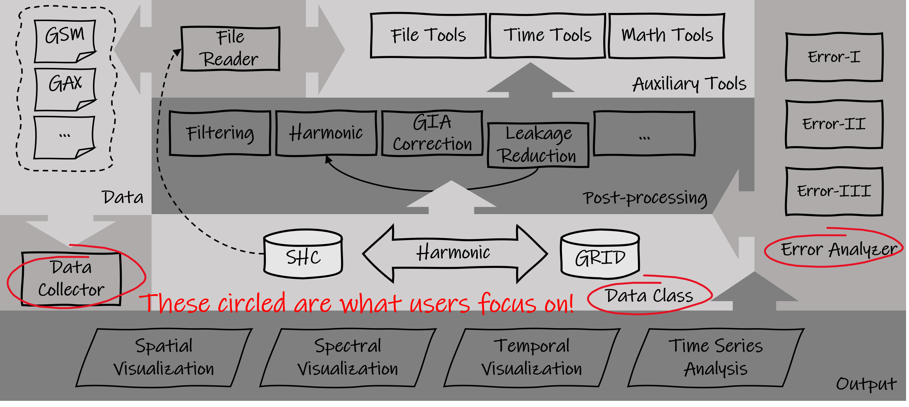

# 1. Introduction

The level-2 time-variable gravity fields obtained from Gravity Recovery and Climate Experiment (GRACE) and its Follow-On (GRACE-FO) mission are widely used in multi-discipline geo-science studies. However, the post-processing of those gravity fields to obtain a desired signal is rather challenging for users that are not familiar with the level-2 products. In addition, the error assessment/quantification of those derived signals, which is of increasing demand in science application, is still a challenging issue even among the professional GRACE(-FO) users. In this effort, the common post-processing steps and the assessment of complicated error (uncertainty) of GRACE(-FO), are integrated into an open-source, cross-platform and Python-based toolbox called SAGEA (SAtellite Gravity Error Assessment). With diverse options, SAGEA provides flexibility to generate signal along with the full error from level-2 products, so that any non-expert user can easily obtain advanced experience of GRACE(-FO) processing. Please contact Shuhao Liu (liushuhao@hust.edu.cn) and Fan Yang (fany@plan.aau.dk) for more information. 

# 2. Features

- Auto-collecting GRACE(-FO) level-2 products and related auxiliary files.
- Commony used methodologies and technologies of GRACE(-FO)'s post-processing.
- Types of Error assessment/quantification of GRACE(-FO) based mass change.
- User interface (under construction).

# 3. Installation

This program homepage is: https://github.com/NCSGgroup/SaGEA.

Use this code to download this project.

`git clone https://github.com/NCSGgroup/SaGEA`

This project is developed based on Python 3.9 and the dependencies are listed in `requirements.txt`.

Use this code to download the dependencies:

`pip install -r requirements.txt`

# 4. Quick Start

Several demo programs are under the direction `./demo/` for users to quickly use and verify.
Users can config the relevant parameters in the corresponding location or an independent JSON file.
Detailed module usage and related scientific explanations will be provided in later chapters.

1. `./demo/data_collecting/demoCollectL2Data.py` provides an example of collecting GRACE Level 2 products,
   including auxiliary files such as GAX and low-degrees products.
   Users can config the collecting parameters from the jason file in `./setting/data_collection/CollectL2Data.json`.
   Other necessary files for this program are provided at https://under.constraction.
2. `./demo/post_processing/demoPostProcessing.py` provides an example for the post-processing of GRACE data.
3. `./demo/uncertainty_estimation/demoErrorI.py` provides an example for the propagation of GRACE error (
   variance-covariance matrix) during the post-processing.
4. `./demo/uncertainty_estimation/demoErrorII.py` provides an example for the estimation of between-group errors through
   TCH (Three Corner Hat) technology on GRACE signals.
5. `./demo/uncertainty_estimation/demoErrorIII.py` provides an example to gain the post-processing statistical
   uncertainty of GRACE signals.

# 5. Overview of Functional Modules and Usages

Fig. 1:
Data structure of SaGEA Toolbox.
Arrows represent dependency relationships.

SaGEA Toolbox is used for post-processing and error assessment of GRACE level-2 data,
with the latter relying on the former, see Fig. 1.
Thus post-processing is the core function of SaGEA toolbox.

SaGEA provides comprehensive post-processing methods.
For ease to use,
we have packaged each method as a function of two data classes:

1. `SHC`, representing spherical harmonic coefficients;
2. `GRID`, representing gridded data.

Supporting that users may not be very familiar with the methods and principles
we recommend calling the post-processing function through SHC or GRID instead of using them directly,
as indicated by the circle in Fig. 1.

Here we briefly provide an overview of the usages about data collection, post-processing, and error assessment.
For detailed user manuals, please refer to http://under.construction.

## 5.1 Data Collection

Path `/pysrc/data_collection/` includes the source file to access remote servers and collect GRACE level-2 products
from the above FTP server,
including the above GSM, GAX, and necessary low-degree files for replacing and other auxiliary files.
It is recommended to control this program through an external configuration file.
A demo program `/demo/data_collecting/demoCollectL2Data.py` gives an example to collect GRACE level-2 files by a
configuration file `/setting/data_collecting/CollectL2Data.json`.
Users can simply modify the parameters in the configuration file and run the above program to achieve automatic
collection of the corresponding files.
This demo program also gives an example to download the low-degree files. Users can simply run the above program to
achieve automatic collections.

## 5.2 Class SHC

### 5.2.1 Creation

Class `SHC` is used to store spherical harmonic coefficients (SHCs),
and can store one or more sets of data.
SHC is the object returned by `load_SHC()` at `./pysrc/auxiliary/load_file/LoadL2SH.py`,
or users can also manually create it by entering the coefficients `SHC(clm, slm)`.

Its attribute `.value` is a two-dimensional `numpy.ndarray` in shape of `(n = num of sets, m = (max_degree + 1)^2)`.
Use `.is_series()` to determine whether the stored data is multiple sets, i.e., whether `n == 1`.

### 5.2.2 Low-degrees replacement

The low-degree coefficients (degree-1, c20, etc.) of GRACE level-2 products usually need to be replaced by another
independent measurement.
Use `.replace_low_degs(dates_begin: iter, dates_end: iter, low_deg: dict,
deg1: bool, c20: bool, c30: bool)` to replace the low-degree coefficients.
Parameters `dates_begin` and `dates_end` should describe the start and end times of `.value`, which is also given
by `load_SHC()` at `./pysrc/auxiliary/load_file/LoadL2SH.py`,
and parameter `low_deg` should be the replaced coefficients given as an instance of `dict`,
it is highly recommended to get it through `load_low_degs()` at `pysrc/auxiliary/load_file/LoadL2LowDeg.py`,
and boolean parameters `deg1`, `c20`, `c30` control whether to replace corresponding coefficients.

### 5.2.3 Addition and subtraction

`SHC` can implement addition and subtraction with another instance through the internal implementation of `__add__()`
and `__sub__()`.
The other instance that are added or subtracted can be sequences of equal length or a single group.
If it is a single sequence,
it will be calculated according to the broadcast principle of `numpy.ndarry`.
However,
in order to cope with different situations,
such as users only needing to add or subtract data from a certain degree to another (like GAX recovery, GMAM correction,
et al.),
it is recommended using the function `.add(other: SHC, lbegin: int, lend :int)`
or `.subreact(other: SHC, lbegin: int, lend :int)` to additionally customize the degree from start (`lbegin`) to
finish (`lend`).

### 5.2.4 Time dimension expansion

Some geophysical signals,
such as the GIA model,
are given as long-term trends.
In order to calculate with the monthly signal,
it is necessary to project it as the signal for each month.
`.expand(time: iter)` can project its value as a linear trend into multiple sets of signal in each time epoch,
and return a new SHC instance.
Note that `.expand(time: iter)` is only supported in single-group SHC instances (i.e., `.is_series()` is `True`)

### 5.2.5 Filtering

Use `.filter(method: str, param: tuple)` to implement spectral domain filters.
The currently supported spectral filters and their usages are:

1. **Decorrelation of SlidingWindow (Swenson2006):**
   `.filter(method="slidingwindow_swenosn2006", param=(n: int, m: int, min_length: int, A: int, K: int))`, see Swenson
   and Wahr (2006);
2. **Decorrelation of SlidingWindow (Stable):**
   `.filter(method="slidingwindow_stable", param=(n: int, m: int, window_length: int))`, see Swenson and Wahr (2006).
3. **Decorrelation of PnMm:**
   `.filter(method="pnmm", param=(n:int, m:int))`, see Chen et al. (2007);
4. **Gaussian Filter:**
   `.filter(method="gs", param=(radius: int, ))` see Wahr et al. (1998);
5. **Non-isotropic Gaussian Filter:**
   `.filter(method="ngs", param=(radius_1: int, radius_2: int, m_0: int))`, see Han et al. (2005);
6. **Fan Filter:**
   `.filter(method="fan", param=(radius_1: int, radius_2: int))` see Zhang et al. (2009);
7. **DDK Filter:**
   `.filter(method="ddk", param=(ddk_id: int, ))`, see Kusche et al.(2007; 2009).

### 5.2.6 Geometrical Correction

Use `.geometric(assumption: str)` to apply the geometrical correction on the SHCs, and the parameter `assumption`
can be chosed as `"sphere"`, `"ellipsoid"` or `"actualEarth"` to support different types of corrections, see Yang et
al. (2022).

### 5.2.7 Harmonic Synthesis

Spherical harmonic synthesis (HMS) is the step of converting (dimensionless) SHCs into grid data of different physical
types (such as equivalent water height, EWH, or pressure, etc.).
Here `SHC` divide it into two steps to implement:

1. **Convert physical type:**

   Use `.convert_type(from_type: str, to_type: str)` to convert the dimensions of coefficients in SHC.
   Currently supported types are:
   `"dimensionless"`, `"EWH"`, `"Pressure"`, `"Density"`, `"Geoid"`, `"Gravity"`, `"HorizontalDisplacementEast"`,
   `"HorizontalDisplacementNorth"` and `"VerticalDisplacement"`.

2. **Pure synthesis:**

   Use `.to_grid(grid_space: int)` to make an HMS on the SHCs, and a new instance of `GRID` will be returned.
   For more detail of class `GRID` please refer to the next section.

## 5.3 Class GRID

### 5.3.1 Creation

Class `GRID` is used to store spatial gridded data,
`GRID()` can also store one or more sets of data.
SHC is the object returned by `SHC().to_grid()`,
or users can also manually create it by entering the coefficients `GRID(value, lat, lon)`.

Its attribute `.value` in a 3-dimension `numpy.ndarray` in shape of `(num, nlat, nlon)`,
with first dimension points to the first set of data, while the second and the third point to the number of latitude and
longitude, respectively.
Thus `GRID()` requires attributes `.lat` and `.lon` that represent geographic latitude and longitude sequences (in unit
of degree).
Use `.is_series()` to determine whether the stored data is multiple sets, i.e., whether `num == 1`.

### 5.3.2 Filtering

(under construction)

Most GRACE filters are designed for spectral domain signals, i.e., they filter SHCs.
While there are still some practical filters implemented in the spatial domain, such as Yi et al. (2021) and Yang et
al. (2024).
Thus `GRID()` provides filtering method to do such kinds of spatial filters,
and the usage is similar with that in `SHC()`:
Use `.filter(method: str, param: tuple)` to perform relevant spatial filtering.

### 5.3.3 Seismic Correction

Use `.seismic(date: iter, events: pathlib.Path)` to perform the seismic correction with several seismic events (in json
file) given by users, see Tang et al. (2020).
Parameters `dates` and `events` are required,
with the former describes the times of `.value`,
and the latter describes the direction of the json file that describes the seismic events.
Path `data/earthquake/earthquakes.json` provided several preset events,
and users can add other events later or specify another file path.

### 5.3.4 Leakage Correction

Use `.leakage(method: str, basin: np.ndarray, filter_type: str, filter_params: tuple, lmax: int, **params)` to deduct
the leakage effect caused by the spectral truncation and filtering.

The currently supported spectral filters and their usages are:

1. **"iterative"**, see Wahr et al. (1998);
2. **"addictive"**, see Klees et al. (2007);
3. **"multiplicative"**, see Longuevergne et al. (2010);
4. **"scaling"**, see Landerer et al. (2012);
5. **"scaling grid"**, see Landerer et al. (2012);
6. **"forward modeling"**, see Chen et al. (2015);
7. **"data_driven"**, see Vishwakarma et al. (2017);
8. **"buffer_zone"**, see Chen et al. (2019).

Unlike the spectral filters, there are significant differences in the parameters required for different methods.
Please refer to the user's manual (under contraction) or code comments for more details.

### 5.3.5 Harmonic Analysis

Use `.to_SHC(lmax: int)` to perform a harmonic analysis (HMA) on the gridded data into SHCs with maximum degree
of `lmax`, and an instance of `SHC` will be returned.

### 5.3.6 Output files

Use `.savefile(filepath: pathlib.Path, time_dim, **params)` to store gridded data in the given path,
and three formats of `.npz`, `.nc`, and `.hdf5` are supported for now.
Parameter `time_dim` is the time dimension and needs to be consistent with the length of the first dimension
of `.value`, and users can input additional parameters `value_description: str` to add descriptions or comments to the
data in saved file.

## 5.4. Error Assessment

(under construction)

# 6. Additional Scientific Descriptions

## 6.1 Data Collection

GRACE and GRACE-FO level-2 products can be obtained at open source FTP server ftp://isdcftp.gfz-potsdam.de/.
Level-2 products includes GSM, GAA, GAB, GAC, and GAD (The last four products are collectively referred to as GAX.),
which are given in fully normalized spherical harmonic coefficients (SHCs) of gravity potential.

- GSM products represent the estimate of Earth's mean gravity field during the specified timespan derived from GRACE
  mission measurements.

- GAA products represent the anomalous contributions of the non-tidal atmosphere to the Earth's mean gravity field
  during the specified timespan.

- GAB products represent the anomalous contributions of the non-tidal dynamic ocean to ocean bottom pressure during the
  specified timespan.

- GAC products represent the sum of the GAA and GAB coefficients during the specified timespan.

- GAD products give the SHCs that are zero over the continents, and provide the anomalous simulated ocean bottom
  pressure that includes non-tidal air and water contributions elsewhere during the specified timespan.

The most used GSM solutions are given by three processing centers, that is, Center for Space Research (CSR), University
of Texas at Austin, Jet Propulsion Laboratory (JPL), NASA, and German Research for Geosciences (GFZ), German.

## 6.2 Loading local GRACE level-2 products and replacing low-degree coefficients

GRACE level-2 GSM solutions lack the three degree-1 coefficients,
which are proportional to geocenter motion and can not been ignored for a complete representation of the mass
redistribution in the Earth system (Sun et al., 2016).
The GRACE-based C20 coefficient is subject to large uncertainties (Chen et al., 2016).
Besides, The C30 coefficient is also shown to be poorly observed by GRACE/GRACE-FO when either mission is operating
without two fully functional accelerometers (Loomis et al., 2020).
Before using the GSM solutions,
the degree-1 coefficients needs to be added back,
and C20, C30 coefficients with large uncertainties also needs to be replaced with estimates from other techniques,
such as satellite laser ranging (SLR).

[//]: # (Path `/pysrc/auxiliary/load_file/LoadL2SH.py` provides functions to load GRACE level-2 products,)

[//]: # (and path `/pysrc/auxiliary/load_file/LoadL2LowDeg.py` provides those of the low-degree coefficient.)

[//]: # (Path `/pysrc/post_processing/replace_low_deg/ReplaceLowDegree.py` includes the source file to apply the replacing)

[//]: # (low-degree coefficients on given SHC.)

## 6.3 Post-processing: Conversion between SHC and GRID

GRACE level-2 products reflects the distribution of dimensionless geopotential,
from which we can obtain the corresponding changes in gravity anomalies,
mass changes or other factors through the load theory.
As a result, the products are usually get converted to the unit of researcher's interest before further use.

Also, GRACE level-2 products are generally given in the form of SHCs,
which can intuitively reflect the signal of different wavelengths (frequency bands).
However, it is difficult to directly see in SHCs how the spatial distribution is.
Indeed, by performing spherical harmonic synthesis on the SHC,
corresponding grid data can be obtained,
from which we can easily see the spatial distribution of signals.
On the contrary, the corresponding SHC can also be obtained through spherical harmonic analysis of grid data.

[//]: # (Path `/pysrc/post_processing/convert_field_physical_quantity/` includes the source files to convert the physical)

[//]: # (quantity like equivalent water height &#40;EWH&#41;,)

[//]: # (and the required Love number can be obtained by the source files in `/pysrc/post_processing/Love_number/LoveNumber.py`.)

[//]: # ()

[//]: # (Path `/pysrc/post_processing/convert_field_physical_quantity/` includes the source files to do the harmonic synthesis)

[//]: # (and analysis.)

[//]: # (and the required associated Legendre polynomial can be obtained by the auxiliary methods in source)

[//]: # (file `/pysrc/auxiliary/tools/MathTools.py`.)

## 6.4 Post-processing: Corrections

### 6.4.1 Low-degrees replacement

Due to the presumed Earth mass conservation and the on-orbit measuring mode,
GRACE(-FO) has no ability to obtain the degree-0 and -1 terms of the gravity field (Wu et al., 2012).
In addition, another major component, C20, is often not well observed,
leading to the common practice of replacing their values with those obtained by Satellite laser ranging (SLR),
which has long been relied upon for measuring changes in Earth’s dynamic oblateness (i.e., C20, see Cheng & Ries, 2017).
Besides, it was further found by Loomis et al. (2020) that, the C30 coefficient,
is also observed by GRACE/GRACE-FO when either mission is operating without two fully functional accelerometers.
Therefore, recommendations are also made to replace C30 with that of SLR.

SaGEA toolbox contains the following option to replace the low-degree terms of the gravity field:

- degree-1 terms given by Sun & Ditmar (2016).
- C20 terms given by Cheng & Ries (2017) and Loomis et al. (2020).
- C30 terms given by Loomis et al. (2020).

### 6.4.2 Filtering spherical harmonic coefficients

Due to the existence of high-order noise and correlation error in the GRACE solutions,
filtering is a necessary step before apply it on some scientific studies (Wahr et al., 2006).
The most usd GRACE filter, isotropic Gaussian filter, was first suggested and applied by Wahr et al. (1998).
Other filters based on different principles were raised then like empirical decorrelation filtering (EDF) raised by
Swenson & Wahr (2006),
DDK filter by Kusche (2007), etc.
Among them, EDF was also improved and used by scholars since its initial proposal (Duan et al., 2009).
SaGEA toolbox contains the following filtering methods:

- Types of EDFs (Swenson & Wahr, 2006; Chen et al., 2007; Duan et al., 2009).
- Isotropic Gaussian filter (Wahr et al., 1998).
- Non-isotropic Gaussian fielter by Han et al. (2005).
- Fan filter by Zhang et al. (2009).
- DDK filter by Kusche et al. (2007, 2009).

### 6.4.3 Leakage Reduction

Filters for GRACE can supress the noise at high degrees, but at the same time they could also weaken the signal as well.
Spatially speaking, signal where it is strong would leak into some place where it is weaker, for example, the
hydrological and atmospheric pressure signals over continents will leak into the oceanic estimates at the coastline (
Wahr et al., 1998). Depending on the signal strength of the study basin, one would consider to reduce the leak-in signal
outside the basin (leakage), or to restore the leak-out signal from the basin (bias).

To reduce the leakage, Wahr et al., 1998 for the first time gave an iterative estimation technique to handle it. Here is
a brief introduction to the technique to estimate the leakage:

One gives the initial signal a small-scale filter, and harmonic synthesis it into a pre-smoothed spatial distribution.
The pre-smoothed spatial signal is set zero outside the interested basin, and then get harmonic analyzed, marked as
pre-smoothed SHCs outside.
Pre-smoothed SHCs outside then get filtered once again of the same scale with that used in the study, and then get
harmonic synthesised it into a new spatial distribution. The new spatial signal inside the interest basin can be seen as
the leakage and reduced from the filtered signal.
As for the bias, it is usually to gain a scale factor k to calibrate the filtered or smoothed signal. Researchers have
raised numbers of method to estimate k, and other methods to restore correct the bias.

SaGEA toolbox contains the following commonly used methods to correct the leakage and bias:

- Iterative (Wahr et al., 1998)
- Multiplicative (Longuevergne et al., 2007).
- Additive (Klees et al., 2007).
- Scaling (Landerer et al., 2012).
- Forward Modeling by (Chen et al., 2015)
- Data-driven (Vishwakarma et al., 2017).
- Buffer zone (Chen et al., 2019)

### 6.4.4 GIA Removal

In the Earth’s gravity anomalies observed by GRACE(-FO), apart from the effects caused by surface mass migration, there
are also influences from GIA driven redistribution of solid Earth mass, which cannot be identified and separated
directly by GRACE(-FO). GIA’s influence is a long-term phenomenon, with effects extending far beyond the temporal
scale of typical GRACE(-FO) observations, which span several decades (Peltier, 2004). Approximately, the impact of GIA
can be considered linear, which allows for a simplified correction by predefined models. Thus, to reflect a true mass
change, the GIA’s linear approximation has to be subtracted from the observed gravity changes.

SaGEA toolbox provides methods for removing GIA in both spectral (for class SHC) and spatial (for class GRID) domains,
including the following commonly used GIA models:

- ICE6G-D (ICE series) by Peltier et al. (2018).
- Geruo2013 by A et al. (2013).
- Caron2018 by Caron et al. (2018).

### 6.4.5 De-aliasing

Due to imperfect tidal models (mainly ocean tides), monthly gravity field solutions from GRACE contain aliasing errors
of frequencies much longer than 30 days, such as the S2 (approximately 161 days), P1 (approximately 171 days) and S1
(approximately 322 days) terms (Knudsen, 2003; Han et al., 2007; Seo et al., 2008). In particular, this aliasing error
is prominent in high latitudes, and thereby needs to be considered (Chen et al., 2009). The aliasing error still remains
as a major error source of the latest gravity product from GRACE(-FO), see Z. Li et al. (2022).

In SAGEA toolbox, either by the Fourier spectrum analysis or by the least square analysis, those aliasing frequency are
identified and removed, and S1, S2, P1 are available options.

### 6.4.6 Geometrical Correction

The geometrical deviation of the actual Earth from the presumed sphere would lead to a bias when converting the
geopotential into TWS (J. Li et al., 2017; Ditmar, 2018; Yang et al., 2022). Such bias would become increasingly
significant as the latitude increases, or as the topography increases. Correction to this bias is termed as geometrical
correction, which indeed consists of an ellipsoid correction and a topography correction.

In SAGEA toolbox, the geometrical correction is implemented following the method of Yang et al. (2022), where one can
easily switch it on or off.

### 6.4.7 Seismic Correction

It is concluded by Chao & Liau (2019) that, the lowest earthquake magnitude threshold that can be detected by GRACE is
the Mw 8.3. This also means, some of largest earthquakes could be directly modelled and removed from GRACE(-FO) monthly
gravity fields, to leave clean enough information to reflect expected hydrological or oceanic signals (Tang et al.,
2020). This procedure is termed as Seismic correction, which is necessary particularly for investigating the ocean
mass change where the seismic clearly biases the estimation. In SAGEA, several seismic events are available for users to
choose from, and we use the logarithmic and exponential function model for fitting those seismic events from GRACE(-FO).

Currently, the seismic events available in SaGEA contain Sumatra 2004, Nias 2005, Bengkulu 2007, Maule 2010, Chile 2010,
Tohoku-Oki 2011, Sumatra 2012 and Okhotsk 2013. On one hand, SaGEA will continue to update the available seismic events,
and on the other hand, users can also edit their own list of seismic events for their need.

### 6.4.8 GAD Recovery

In addition to the corrections that are universal and common for all regions, there is some other correction that is
specific only for certain study, e.g., to study the global mean ocean mass (GMOM) change. To obtain the complete ocean
mass, the non-tidal ocean mass, which have been modelled by ocean general circulation model and removed from the gravity
field as prior model, has to be restored. This correction is done by added back another official gravity product, named
GAD (the monthly average of ocean bottom pressure anomalies), which we know as GAD recovery.

In the SaGEA toolbox, the GAD model can be easily collected, just like the GRACE level-2 products. And such correction,
which one can easily switch on or off, is also integrated into it.

### 6.4.9 GMAM Correction

GMAM correction is proposed by Chen et al. (2019) to compensate the offset in Earth mass conservation due to the absence
of global mean atmospheric mass (GMAM). Chen et al. (2019) found a constant annual phase lag(for about 10 deg) between
GRACE and Altimeter-Argo estimates of GMOM changes. By removing GMAM from the GRACE solutions using atmospheric model
(GAA, the monthly average of atmosphere), this annual phase lag is nearly compensated.

In SaGEA toolbox, the GAA model can be also easily collected, and the corresponding correction, which one can easily
switch on or off, is integrated into SaGEA toolbox.

## 6.5 Post-processing: Spatial and temporal analysis

### 6.5.1 Spatial analysis

Spatial analysis mainly indicates the extraction of basin-scale variability,
like TWS (Total Water Storage) changes.
It can be done in the spatial or the spectral domain (Swenson and Wahr, 2002), i.e.,

- Geographic-latitude weighted sum of gridded signal in spatial domain.
- Direct product sum of SHCs in spectral domain.

Simply put, it is the use of gridded or spherical harmonic signals,
as well as corresponding basin information, to extract target signals.
While these two methods are theoretically equivalent,
there are differences in practice due to the loss of spatial/spectral conversion.

SaGEA provides both of the two approaches,
and users can choose them according to their needs.

### 6.5.2 Temporal analysis

The seasonality in time-series of GRACE(-FO) based mass change, i.e.,
the secular trend, inter-annual periodic signal and seasonal periodic signals,
is of particular interest of geoscience studies (Tapley et al., 2019).

SaGEA provides three approaches to gain the seasonality from a time-series (of GRACE and GRACE-FO based mass change),
that is,

- Ordinary least squares (OLS).
- Weighted least squares (WLS).
- Fourier analysis.

A majority of publication with GRACE(-FO) prefers to use OLS for extracting seasonality as the error is always presumed
as heterogeneous and uniform.
Further, WLS makes sense since SaGEA is able to provide the error information, otherwise WLS should be disabled.
Another general tool, the Fourier analysis, is also able to obtain the seasonality other than a priori information.

## 6.6 Error assessment

### 6.6.1 Error-I

  Due to the imperfect background models (Hauk and Pail, 2018; Yang et al., 2021) and on-board instrument error (
  Bandikova
  and Flury, 2014; Flechtner et al., 2016),
  GRACE(-FO) level-2 monthly gravity product is generated with an intrinsic uncertainty,
  known as formal error that represents the variance of each SHC.
  Besides, ITSG solutions provide the full variance covariance matrix of these SHCs (Kvas et al., 2019; Kvas and
  Mayer-Gürr, 2019).
  As one has to post-process the level-2 product to derive desired variables (known as level-3 products),
  the formal error, or the variance-covariance matrix,
  needs to be propagated to support uncertainty estimation of the level-3 product.
  Such kind of error is indicated as Error-I and integrated in SaGEA program.

### 6.6.2 Error-II

  Besides the official GRACE data producers,
  multiple producers are routinely producing level-2 solutions and contributing them to the International Centre for
  Global Earth Models (ICGEM).
  These level-2 products are different from each other,
  therefore, the discrepancy between these level-2 products shall result in various estimates of desired variables,
  e.g., TWS estimation.
  Such a discrepancy is considered as between-group error, which is indicated as Error-II in SaGEA program.
  As the most popular technique,
  the TCH (Three-Cornered Hat, Ferreira et al., 2016; Chen et al., 2021) is integrated in SaGEA to consider the Error-II
  of desired variables.

### 6.6.3 Error-III

  This category of error might be caused by the non-uniqueness of the post-processing chain and the involvement of
  corrections with less known uncertaintiesm.
  As there is no official convention of post-processing chain, each study has adopted its own strategy, resulting in
  potential large discrepancy (indicated as Error-III in SaGEA) at obtained level-3 products.
  Error-III is considered as the within-group error since it always relies upon only one set of level-2 product.
  To quantify it, a large number of ensembles, which reflect various postprocessing chains, are required.
  As the advanced post-processing module are provided in SaGEA, a comprehensive quantification of Error-III at a diverse
  and flexible option is possible.
  Therefore, based on the post-processing module, SaGEA also provides a quantization program for Error-III.

# 7. Contributing
(under construction)

# 8. License

MIT License

Copyright (c) 2024 NCSG -- Numerical Computation and Satellite Geodesy research group

Permission is hereby granted, free of charge, to any person obtaining a copy
of this software and associated documentation files (the "Software"), to deal
in the Software without restriction, including without limitation the rights
to use, copy, modify, merge, publish, distribute, sublicense, and/or sell
copies of the Software, and to permit persons to whom the Software is
furnished to do so, subject to the following conditions:

The above copyright notice and this permission notice shall be included in all
copies or substantial portions of the Software.

THE SOFTWARE IS PROVIDED "AS IS", WITHOUT WARRANTY OF ANY KIND, EXPRESS OR
IMPLIED, INCLUDING BUT NOT LIMITED TO THE WARRANTIES OF MERCHANTABILITY,
FITNESS FOR A PARTICULAR PURPOSE AND NONINFRINGEMENT. IN NO EVENT SHALL THE
AUTHORS OR COPYRIGHT HOLDERS BE LIABLE FOR ANY CLAIM, DAMAGES OR OTHER
LIABILITY, WHETHER IN AN ACTION OF CONTRACT, TORT OR OTHERWISE, ARISING FROM,
OUT OF OR IN CONNECTION WITH THE SOFTWARE OR THE USE OR OTHER DEALINGS IN THE
SOFTWARE.

# Reference

A, G., Wahr, J., Zhong, S., 2013. Computations of the viscoelastic response of a 3-D compressible Earth to surface
loading: an application to Glacial Isostatic Adjustment in Antarctica and Canada. Geophysical Journal International 192,
557–572. https://doi.org/10.1093/gji/ggs030

Bandikova, T., Flury, J., 2014. Improvement of the GRACE star camera data based on the revision of the combination
method. Advances in Space Research 54, 1818–1827. https://doi.org/10.1016/j.asr.2014.07.004.

Caron, L., Ivins, E. R., Larour, E., Adhikari, S., Nilsson, J., & Blewitt, G., 2018. GIA Model Statistics for GRACE
Hydrology, Cryosphere, and Ocean Science. Geophysical Research Letters, 45 (5),
2203–2212. https://doi.org/10.1002/2017gl076644

Chao, B. F., & Liau, J. R., 2019. Gravity Changes Due to Large Earthquakes Detected in GRACE Satellite Data via
Empirical Orthogonal Function Analysis. Journal of Geophysical Research: Solid Earth, 124 (3),
3024-3035. https://doi.org/10.1029/2018jb016862

Chen, J.L., Wilson, C.R., Ries, J.C., 2016. Broadband assessment of degree-2 gravitational changes from GRACE and other
estimates, 2002-2015. Journal of Geophysical Research: Solid Earth 121, 2112–2128. https://doi.org/10.1002/2015jb012708

Chen, J.L., Wilson, C.R., Tapley, B.D., Grand, S., 2007. GRACE detects coseismic and postseismic deformation from the
Sumatra-Andaman earthquake. Geophysical Research Letters 34. https://doi.org/10.1029/2007gl030356.

Chen, J.L., Wilson, C. R., & Seo, K.-W., 2009. S2 tide aliasing in GRACE time-variable gravity solutions. Journal of
Geodesy , 83 (7), 679–687. https://doi.org/10.1007/s00190-008-0282-1

Chen, J.L., Tapley, B., Tamisiea, M.E., Save, H., Wilson, C., Bettadpur, S., Seo, K., 2021. Error Assessment of GRACE
and GRACE Follow-On Mass Change. Journal of Geophysical Research: Solid Earth 126. https://doi.org/10.1029/2021jb022124.

Cheng, M., & Ries, J. (2017). The unexpected signal in GRACE estimates of c20. Journal of Geodesy , 91 (8), 897-914.
https://doi.org/10.1007/s00190-016-0995-5

Ditmar, P., 2018. Conversion of time-varying Stokes coefficients into mass anomalies at the Earth’s surface considering
the Earth’s oblateness. Journal of Geodesy , 92 (12), 1401–1412. https://doi.org/10.1007/s00190-018-1128-0

Duan, X. J., Guo, J. Y., Shum, C. K., & Van Der Wal, W., 2009, On the postprocessing removal of correlated errors in
GRACE temporal gravity field solutions. Journal of Geodesy, 83(11), 1095–1106. https://doi.org/10.1007/s00190-009-0327-0

Ferreira, V., Montecino, H., Yakubu, C., Heck, B., 2016. Uncertainties of the Gravity Recovery and Climate Experiment
time-variable gravity-field solutions based on three-cornered hat method. Journal of applied remote sensing 10,
015015–015015. https://doi.org/10.1117/1.JRS.10.015015.

Flechtner, F., Neumayer, K.H., Dahle, C., Dobslaw, H., Fagiolini, E., Raimondo, J.C., Güntner, A., 2016. What can be
expected from the GRACE-FO laser ranging interferometer for earth science applications? Remote sensing and water
resources , 263–280. https://doi.org/10.1007/s10712-015-9338-y.

Han, S.-C., Shum, C. K., Jekeli, C., Kuo, C.-Y., Wilson, C., & Seo, K.-W., 2005, Non-isotropic filtering of GRACE
temporal gravity for geophysical signal enhancement. Geophysical Journal International, 163(1),
18–25. https://doi.org/10.1111/j.1365-246x.2005.02756.x

Han, S.-C., Ray, R. D., & Luthcke, S. B., 2007. Ocean tidal solutions in Antarctica from GRACE inter-satellite tracking
data. Geophysical Research Letters, 34 (21). https://doi.org/10.1029/2007GL031540

Hauk, M., Pail, R., 2018. Treatment of ocean tide aliasing in the context of a next generation gravity field mission.
Geophysical Journal International
214, 345–365. https://doi.org/10.1093/gji/ggy145.

Klees, R., Zapreeva, E. A., Winsemius, H. C., & Savenije, H. H. G.， 2007. The bias in GRACE estimates of continental
water storage variations. Hydrology and Earth System Sciences, 11(4),
1227–1241. https://doi.org/10.5194/hess-11-1227-2007

Knudsen, P., 2003. Ocean tides in GRACE Monthly Averaged Gravity Fields. Space Science Reviews, 108 (1),
261–270. https://doi.org/10.1023/A:1026215124036

Kusche. J., 2007. Approximate decorrelation and non-isotropic smoothing of time-variable GRACE-type gravity field
models. Journal of Geodesy, 81(11), 733–749. https://doi.org/10.1007/s00190-007-0143-3

Kvas, A., Behzadpour, S., Ellmer, M., Klinger, B., Strasser, S., Zehentner, N., Mayer-Gürr, T., 2019. ITSG-Grace2018:
Overview and evaluation of a new GRACE-only gravity field time series. Journal of Geophysical Research: Solid Earth 124,
9332–9344. https://doi.org/10.1029/2019JB017415.

Kvas, A., Mayer-Gürr, T., 2019. GRACE gravity field recovery with background model uncertainties. Journal of geodesy 93,
2543–2552. https://doi.org/10.1007/s00190-019-01314-1.

Landerer, F. W., & Swenson, S. C., 2012. Accuracy of scaled GRACE terrestrial water storage estimates. Water Resources
Research, 48(4). https://doi.org/10.1029/2011wr011453

Li, J., Chen, J. L., Li, Z., Wang, S., & Hu, X., 2017. Ellipsoidal correction in GRACE Surface Mass Change Estimation.
Journal of Geophysical Research: Solid Earth, 122 (11), 9437–9460. https://doi.org/10.1002/2017jb014033

Li, Z., Zhang, Z., & Wang, H., 2022. On tide aliasing in GRACE Time-Variable Gravity Observations. Remote Sensing ,
14 (21), 5403. https://doi.org/10.3390/rs14215403

Longuevergne, L., Scanlon, B. R., & Wilson, C. R.. 2010.， GRACE Hydrological estimates for small basins: Evaluating
processing approaches on the High Plains Aquifer, USA. Water Resources Research, 46(
11). https://doi.org/10.1029/2009wr008564

Loomis, B. D., Rachlin, K. E., Wiese, D. N., Landerer, F. W., & Luthcke, S. B. (2020). Replacing GRACE/GRACE-FO With
Satellite Laser Ranging: Impacts on Antarctic Ice Sheet Mass Change. Geophysical Research Letters, 47 (3).
https://doi.org/10.1029/2019gl085488

Peltier, W. (2004). GLOBAL GLACIAL ISOSTASY AND THE SURFACE OF THE ICE-AGE EARTH: The ICE-5G (VM2) Model and GRACE.
Annual Review of Earth and Planetary Sciences, 32 (1), 111-149. https://doi.org/10.1146/annurev.earth.32.082503.144359

Seo, K.-W., Wilson, C. R., Chen, J. L., & Waliser, D. E., 2008. GRACE’s spatial aliasing error. Geophysical Journal
International, 172 (1), 41–48. https://doi.org/10.1111/j.1365-246X.2007.03611.x

Sun, Y., Riva, R., Ditmar, P., 2016. Optimizing estimates of annual variations and trends in geocenter motion and J2
from a combination of GRACE data and geophysical models. Journal of Geophysical Research: Solid Earth 121,
8352–8370. https://doi.org/10.1002/2016jb013073

Swenson, S., Wahr, J., 2002. Methods for inferring regional surface-mass anomalies from Gravity Recovery and Climate
Experiment (GRACE) measurements of time-variable gravity. Journal of Geophysical Research: Planets 107, ETG 3–1–ETG 3–1.
https://doi.org/10.1029/2001jb000576.

Swenson, S., Wahr, J., 2006. Post-processing removal of correlated errors in GRACE data, Geophysical Research Letters.
https://doi.org/10.1029/2005gl025285.

Tang, L., Li, J., Chen, J. L., Wang, S.-Y., Wang, R., & Hu, X., 2020. Seismic Impact of Large Earthquakes on Estimating
Global Mean Ocean Mass Change from GRACE. Remote Sensing , 12 (6), 935. https://doi.org/10.3390/rs12060935

Tapley, B.D., Watkins, M.M., Flechtner, F., Reigber, C., Bettadpur, S., Rodell, M., Sasgen, I., Famiglietti, J.S.,
Landerer, F.W., Chambers, D.P., et al.,2019. Contributions of GRACE to understanding climate change. Nature Climate
Change 9, 358–369. https://doi.org/10.1038/s41558-019-0456-2.

Vishwakarma, B. D., Horwath, M., Devaraju, B., Groh, A., & Sneeuw, N., 2017. A Data-Driven Approach for Repairing the
Hydrological Catchment Signal Damage Due to Filtering of GRACE Products. Water Resources Research, 53(11),
9824–9844. https://doi.org/10.1002/2017wr021150

Vishwakarma, B., Devaraju, B., & Sneeuw, N., 2018, What Is the Spatial Resolution of grace Satellite Products for
Hydrology?. Remote Sensing, 10(6), 852. https://doi.org/10.3390/rs10060852

Wahr, J., Molenaar, M., Bryan, F., 1998. Time variability of the Earth's gravity field: Hydrological and oceanic effects
and their possible detection using GRACE. Journal of Geophysical Research: Space Physics 103,
30205–30229. https://doi.org/10.1029/98jb02844

Wu, X., Ray, J., & van Dam, T., 2012. Geocenter motion and its geodetic and geophysical implications. Journal of
Geodynamics, 58 , 44–61. https://doi.org/10.1016/j.jog.2012.01.007

Yang, F., Luo, Z., Zhou, H., & Kusche, J., 2022. On study of the earth topography correction for the GRACE surface
mass estimation. Journal of Geodesy , 96 . https://doi.org/10.1007/s00190-022-01683-0

Yang, F., Forootan, E., Wang, C., Kusche, J., Luo, Z., 2021. A New 1-Hourly ERA5-Based Atmosphere De-Aliasing Product
for GRACE, GRACEFO, and Future Gravity Missions. Journal of Geophysical Research: Solid Earth 126, e2021JB021926.
https://doi.org/10.1029/2021JB021926.

Yang, F., Forootan, E., Liu, S., & Schumacher, M. (2024). A Monte Carlo Propagation of the Full Variance-Covariance of
GRACE-Like Level-2 Data With Applications in Hydrological Data Assimilation and Sea-Level Budget Studies. Water
Resources Research, 60 (9), e2023WR036764. https://doi.org/10.1029/2023WR036764449.

Yi,S.,& Sneeuw,N. (2022). A novel spatial filter to reduce north south striping noise in GRACE spherical harmonic
coefficients. Journal of Geodesy,96(4),23. https://doi.org/10.1007/s00190-022-01614-z.

Zhang, Z.-Z., Chao, B. F., Lu, Y., & Hsu, H.-T., 2009, An effective filtering for GRACE time-variable gravity: Fan
filter. Geophysical Research Letters, 36(17). https://doi.org/10.1029/2009gl039459

